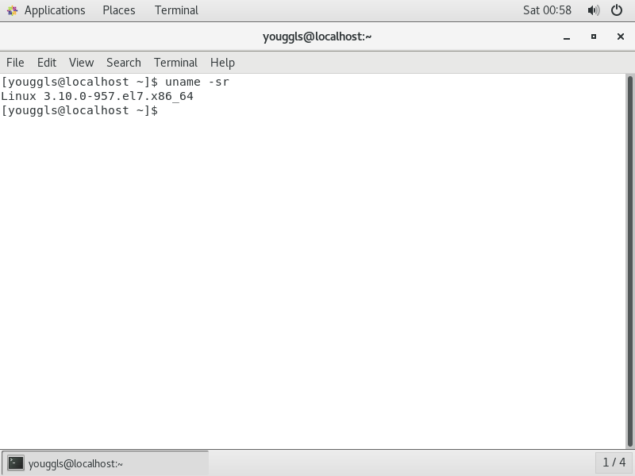
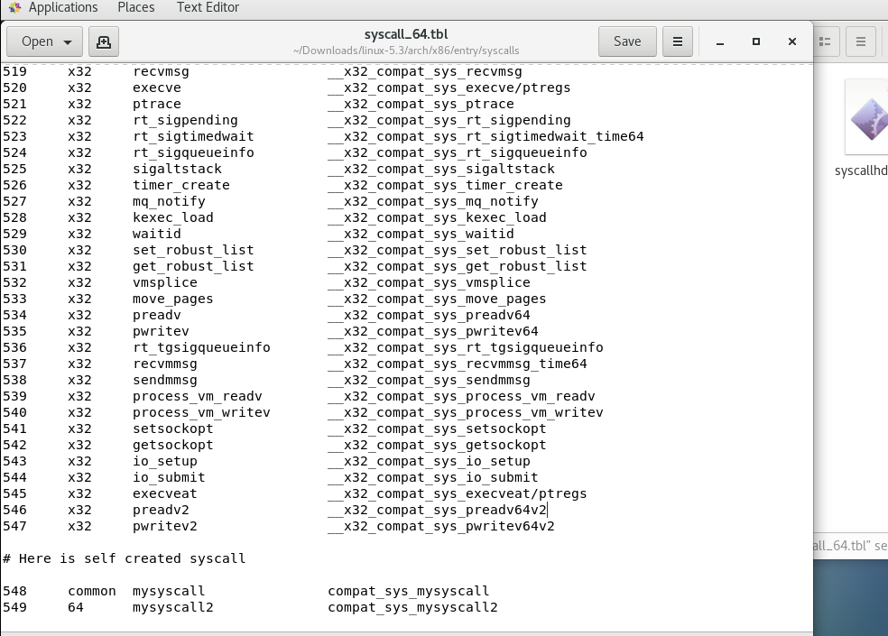
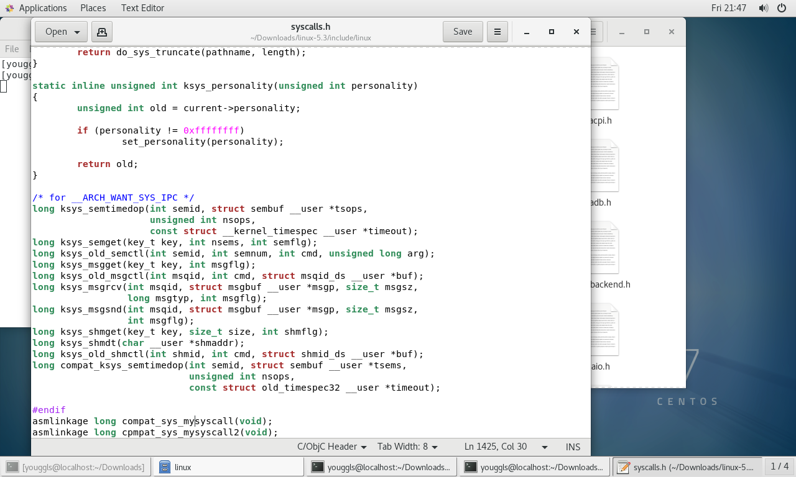
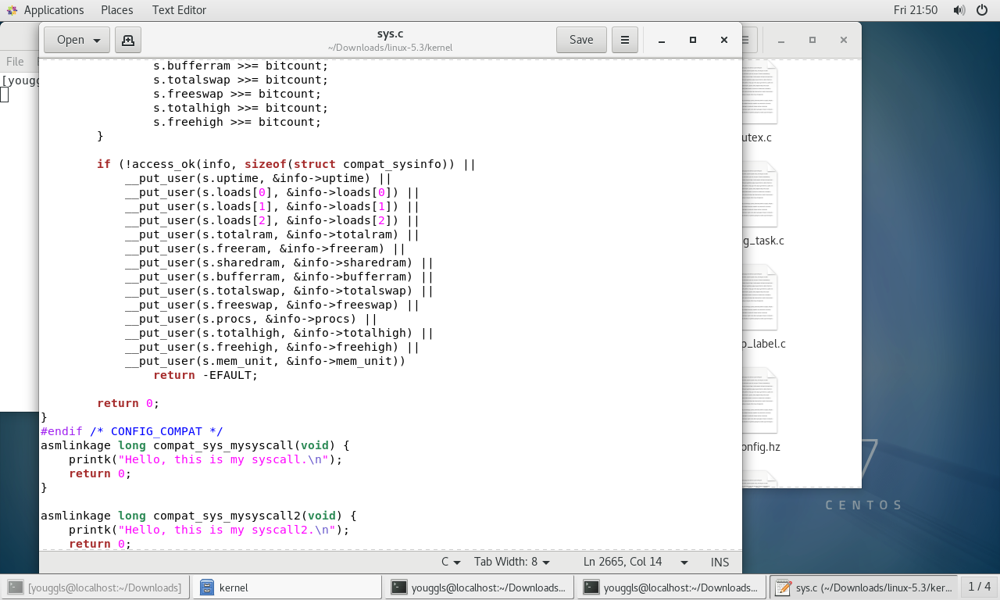
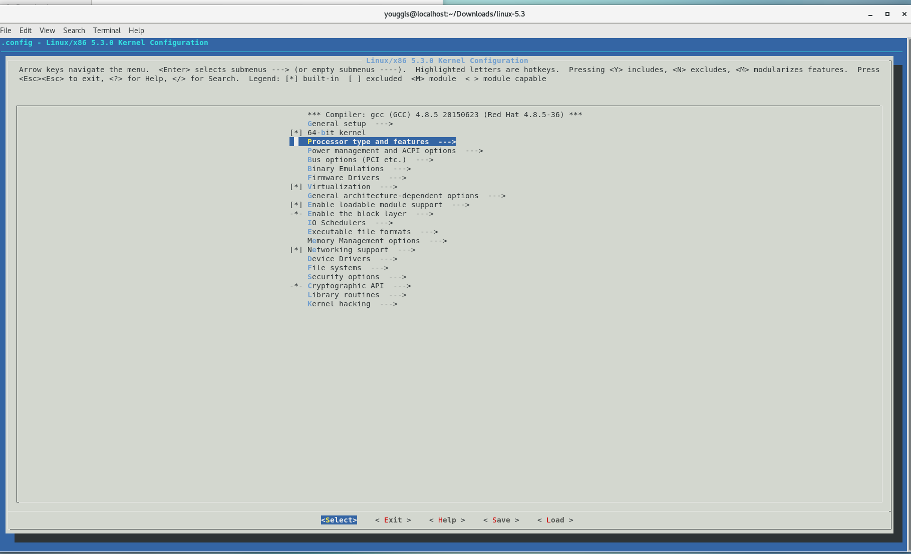
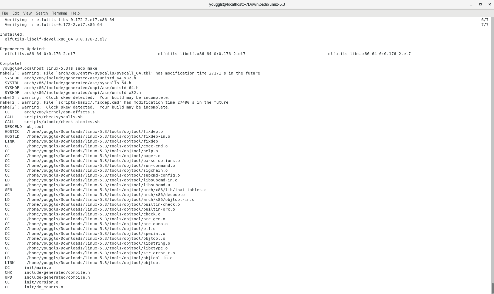
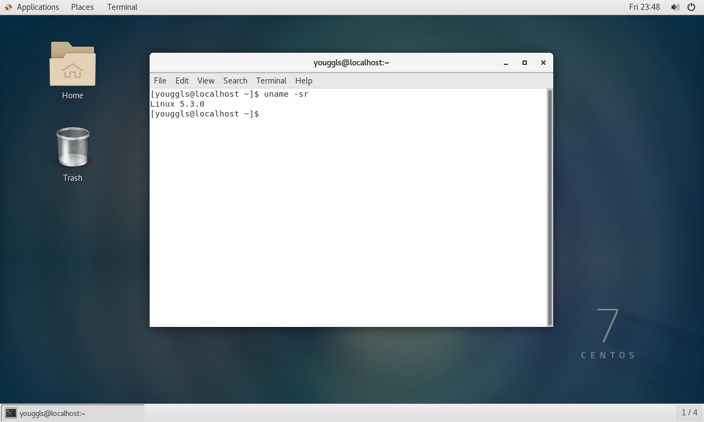
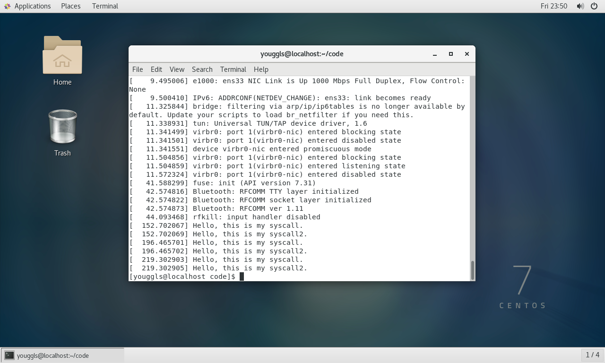

# 操作系统实验报告

## 实验内容

1. 在虚拟机上安装CentOS操作系统

2. 下载Linux Kernel最新源码

3. 编译Kernel源码，并使用编译的Kernel启动

## 实验步骤

1. 使用VMwarer安装CentOS，并查看内核版本

    

2. 下载[Linux Kernel](https://www.kernel.org)源码

3. 解压源码包

4. 增加自定义的系统调用

    1. 修改`./arch/x86/entry/syscalls/syscall_64_tbl`文件，在最后加入两个系统调用
        
    2. 修改`./include/linux/syscalls.h`文件，在最后加入系统调用的声明
        
    3. 修改`./kernel/sys.c`文件，在最后实现系统调用的声明
        

5. 进入源码目录，执行`make menuconfig`生成`.config`文件

    

6. 执行`make`命令进行编译

    

7. 执行`make modules_install`安装模块

8. 执行`make install`安装核心

9. 修改`/etc/default/grub`，修改默认启动顺序

10. 重启系统，查看内核版本

    
    可以看到，内核已经是最新版本

11. 测试自定义系统调用

    1. 新建一个c文件，内容如下

        ```c
        #include<unistd.h>
        int main() {
            syscall(548);
            syscall(549);
            return 0;
        }
        ```

    2. 使用gcc编译
    3. 允许`a.out`输出
    4. 在shell中输入`dmesg`，查看系统调用
        
