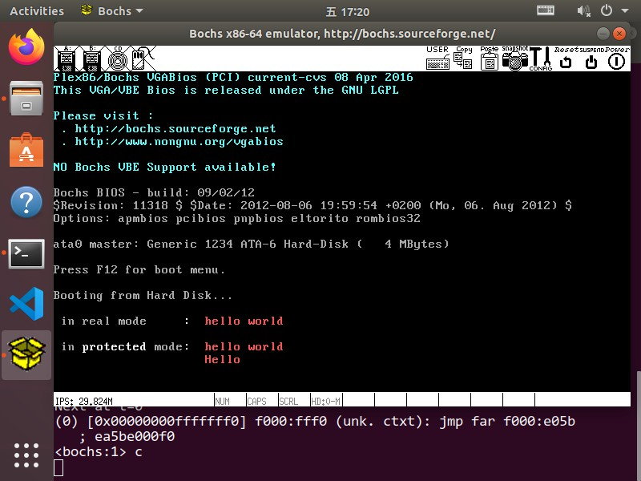

# 操作系统实验报告

## 实验内容

1. 实现boot.S中缺少的函数，修改main.c，在实现的函数中调用main.c的bootmain函数

2. 尝试缩减inc文件夹中的内容，移除与本实验无观的内容

## 实验步骤

1. 修改boot.S，在boot.S中的58行加入如下函数定义

    ```x86asm
    protcseg:
        movw    $PROTECT_MODE_DSEG, %ax
        movw    %ax, %ds
        movw    %ax, %es
        movw    %ax, %fs
        movw    %ax, %gs
        movw    %ax, %ss

        movl    $msg2, %esi
        movl    $0xb8d22, %edi
        movl    $62, %ecx
        rep     movsb

        movl    $start, %esp
        call    bootmain
    ```

2. 修改main.c，在函数第一行加入如下内容

    ```c
    __asm __volatile("movl %0, %%esi\n\tmovl $0xb8dea, %%edi\n\tmovl $20, %%ecx\n\t rep movsb"::"r"(msg3));
    ```

3. 执行`make run`，观察输出

4. 经过观察，发现只有`inc/mmu.h`头文件中的内容被使用，我们把头文件内容复制到boot.S的开头即可。

## 实验结果


