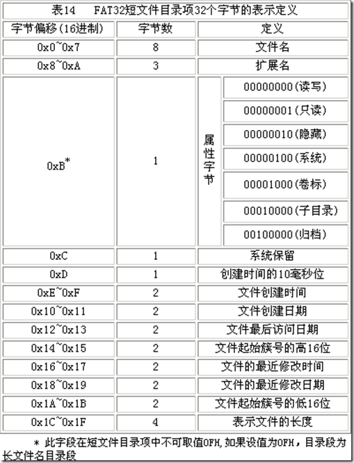
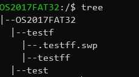
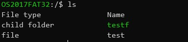
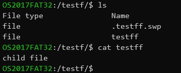

# 操作系统实验报告

## 实验内容

1. 实现对FAT32文件系统的访问

2. tree命令

3. ls命令

4. cat命令

5. cd命令

## 实验分析

1. 为了实现对FAT32文件系统的读操作，必须读取DBR扇区的引导信息，并使用结构体保存下来。

2. 为了实现对文件目录的读写，必须把每个FAT32的目录项用结构体保存下来。

    

3. 读取数据时，需要根据不同的字节数读取不同的内容，分为4字节读取、2字节读取、单字节读取。数据类型也要采用相应正确的类型。

## 实验过程

1. DBR信息结构体

    ```c
    struct DBR_info
    {
        // The number of Bytes per sector.
        unsigned int sector_size;
        // Sectors per FAT. The size of the FAT in sectors.
        unsigned int fat_table_num;
        // Sector size
        unsigned int fat_table_size;
        // Number of reserved sectors.
        unsigned int res_sector;
        // Root dir offset(Bytes)
        unsigned int root_dir_offset;
        // Sectors per cluster
        unsigned int cluster_num;
        // Fat1 offset
        unsigned int fat1_offset;
        // Entry number per cluseter
        unsigned int entry_num_per_cluster;
    };
    typedef struct DBR_info DBR;

    DBR* init_DBR(FILE* img) {
        DBR* dbr = (DBR*)malloc(sizeof(DBR));
        dbr->sector_size = read_word_from_img(img, SECTOR_SIZE_BEGIN);
        dbr->fat_table_num = read_byte_from_img(img, FAT_NUMBER_BEGIN);
        dbr->fat_table_size = read_double_word_from_img(img, FAT_SIZE_BEGIN);
        dbr->res_sector = read_word_from_img(img, RES_SECOTR_SIZE_BEGIN);
        dbr->cluster_num = read_byte_from_img(img, CLUSTER_NUMBER_BEGIN);
        dbr->fat1_offset = dbr->res_sector * dbr->sector_size;
        dbr->root_dir_offset = dbr->sector_size * (dbr->res_sector + dbr->fat_table_num * dbr->fat_table_size);
        dbr->entry_num_per_cluster = dbr->cluster_num * dbr->sector_size / 0X20;
        return dbr;
    }
    ```

2. 文件目录项结构体，长短目录项统一使用一个类型

    ```c
    struct file_entry
    {
        // File name
        uint8_t* name;
        // Properties byte
        uint8_t property;
        uint8_t isLastLongName;
        unsigned int file_cluster_index;
        unsigned int file_size;
    };

    entry* read_entry(DBR* dbr, FILE* img, size_t index) {
        uint8_t FDT = read_byte_from_img(img, index);
        if (FDT == 0X00) return NULL;
        entry* e = (entry*)malloc(sizeof(entry));
        e->property = read_byte_from_img(img, index + FILE_PROPERTIES);
        if (e->property != LONG_ENTRY) {
            e->name = (uint8_t*)malloc((SHORT_FILE_NAME_SIZE + 1) * sizeof(uint8_t));
            fseek(img, index, SEEK_SET);
            fread(e->name, SHORT_FILE_NAME_SIZE, sizeof(uint8_t), img);
            unsigned int high_address = read_word_from_img(img, index + HIGH_CLUSTER_ADDRESS);
            unsigned int low_address = read_word_from_img(img, index + LOW_CLUSTER_ADDRESS);
            unsigned int temp = high_address << 16;
            e->file_cluster_index = temp + low_address;
        } else {
            e->name = (uint8_t*)malloc(LONG_FILE_NAME_SIZE * sizeof(uint8_t));
            for (int i = 0; i < LONG_NAME_SIZE1; i++) {
                e->name[i] = read_word_from_img(img, index + i * 2 + LONG_NAME_OFFSET1);
            }
            for (int i = 0; i < LONG_NAME_SIZE2; i++) {
                e->name[i + LONG_NAME_SIZE1] = read_word_from_img(img, index + i * 2 + LONG_NAME_OFFSET2);
            }
            for (int i = 0; i < LONG_NAME_SIZE3; i++) {
                e->name[i + LONG_NAME_SIZE1 + LONG_NAME_SIZE2] = read_word_from_img(img, index + i * 2 + LONG_NAME_OFFSET3);
            }
        }

        e->file_size = read_word_from_img(img, index + FILE_LENGTH);
        return e;
    }
    ```

3. 文件树节点类型

    为了更加方便对文件系统进行读写操作，每读取一个目录项后，都要构造相应的树节点来方便访问。

    ```c
    struct file_tree {
        entry* e;
        struct file_tree* parent;
        struct file_tree* peer;
        struct file_tree* child;
    };
    typedef struct file_tree tree_node;

    tree_node* init_tree_node(uint8_t* name, uint8_t property, unsigned int file_cluster_index, unsigned int file_size, tree_node* parent) {
        entry* e = (entry*)malloc(sizeof(entry));
        int length_of_file_name = strlen(name) + 1;
        e->name = (uint8_t*)malloc(length_of_file_name * sizeof(char));
        strcpy(e->name, name);
        e->property = property;
        e->file_cluster_index = file_cluster_index;
        e->file_size = file_size;
        e->isLastLongName = 0;
        tree_node* rev = (tree_node*)malloc(sizeof(tree_node));
        rev->e = e;
        rev->parent = parent;
        if (parent != NULL && parent->child == NULL) parent->child = rev;
        rev->child = NULL;
        rev->peer = NULL;
        return rev;
    }

    ```

## 实验结果

1. tree命令：

    

2. ls命令：

    

3. cat命令：

    

## 附录：源代码

[github](https://github.com/Youggls/OperatingSystemHomework/tree/master/lab12/src)

### tools.h

```c
#ifndef TOOLS_H
#define TOOLS_H
#include <stdlib.h>
#include <stdio.h>
#include <stdint.h>
#include "./fat32.h"

#define DOUBLE_WORD 4
#define WORD 2
struct DBR_info
{
    // The number of Bytes per sector.
    unsigned int sector_size;
    // Sectors per FAT. The size of the FAT in sectors.
    unsigned int fat_table_num;
    // Sector size
    unsigned int fat_table_size;
    // Number of reserved sectors.
    unsigned int res_sector;
    // Root dir offset(Bytes)
    unsigned int root_dir_offset;
    // Sectors per cluster
    unsigned int cluster_num;
    // Fat1 offset
    unsigned int fat1_offset;
    // Entry number per cluseter
    unsigned int entry_num_per_cluster;
};
typedef struct DBR_info DBR;

struct file_entry
{
    // File name
    uint8_t* name;
    // Properties byte
    uint8_t property;
    uint8_t isLastLongName;
    unsigned int file_cluster_index;
    unsigned int file_size;
};

typedef struct file_entry entry;

void free_enrty(entry* e);

struct file_tree {
    entry* e;
    struct file_tree* parent;
    struct file_tree* peer;
    struct file_tree* child;
};

typedef struct file_tree tree_node;

tree_node* init_tree_node(uint8_t* name, uint8_t property, unsigned int file_cluster_index, unsigned int file_size, tree_node* parent);

void tree(tree_node* root, size_t depth);

// Read a byte from img file.
uint8_t read_byte_from_img(FILE* img, size_t index);

// Read word(2 bytes)
uint16_t read_word_from_img(FILE* img, size_t index);

// Read double word(int)
uint32_t read_double_word_from_img(FILE* img, size_t index);

uint8_t* read_file_from_img(DBR* dbr, FILE* img, uint32_t cluster);

// Init DBR sector
DBR* init_DBR(FILE* img);

// Print dbr info
void print_dbr(DBR* dbr);

// Read a sector from img
char* read_sector_from_img(DBR* fat, FILE* img, size_t index);

entry* read_entry(DBR* fat, FILE* img, size_t index);

entry** read_entry_from_cluster(DBR* fat, FILE* img, size_t cluster);

tree_node* walk_path(DBR* dbr, FILE* img, size_t cluster, size_t depth, tree_node* parent);

uint32_t get_next_cluster_number(DBR* dbr, FILE* img, size_t cluster);

void print_entry(entry* entry);

void cat(DBR* file, FILE* img, tree_node* node);

#endif
```

### tools.c

```c
#include "tools.h"
#include <string.h>
#include <wchar.h>

uint8_t read_byte_from_img(FILE* img, size_t index) {
    fseek(img, index, SEEK_SET);
    return fgetc(img);
}

uint16_t read_word_from_img(FILE* img, size_t index) {
    uint8_t buff[WORD];
    fseek(img, index, SEEK_SET);
    fread(buff, WORD, sizeof(uint8_t), img);
    uint16_t ans = buff[0];
    ans += buff[1] << 8;
    return ans;
}

// Read double word(int)
uint32_t read_double_word_from_img(FILE* img, size_t index) {
    uint8_t buff[DOUBLE_WORD];
    fseek(img, index, SEEK_SET);
    fread(buff, DOUBLE_WORD, sizeof(uint8_t), img);
    uint32_t ans = buff[0];
    ans += buff[1] << 8;
    ans += buff[2] << 16;
    ans += buff[3] << 24;
    return ans;
}

uint8_t* read_file_from_img(DBR* dbr, FILE* img, uint32_t cluster) {
    uint32_t count = 0;
    uint32_t c = cluster;
    while (c != END_OF_FILE) {
        c = get_next_cluster_number(dbr, img, c);
        count++;
    }
    uint32_t buffer_size = dbr->cluster_num * dbr->sector_size * sizeof(uint8_t);
    uint8_t* total_buffer = (uint8_t*)malloc(count * buffer_size + 1);
    uint8_t* buffer = (uint8_t*)malloc(buffer_size);
    c = cluster;
    count = 0;
    while (c != END_OF_FILE) {
        uint32_t offset = dbr->root_dir_offset + dbr->cluster_num * (c - 2) * dbr->sector_size;
        fseek(img, offset, SEEK_SET);
        fread(buffer, buffer_size, sizeof(uint8_t), img);
        strncpy(total_buffer + count * buffer_size, buffer, buffer_size);
        c = get_next_cluster_number(dbr, img, c);
        count++;
    }
    //free(buffer);
    return total_buffer;
}

DBR* init_DBR(FILE* img) {
    DBR* dbr = (DBR*)malloc(sizeof(DBR));
    dbr->sector_size = read_word_from_img(img, SECTOR_SIZE_BEGIN);
    dbr->fat_table_num = read_byte_from_img(img, FAT_NUMBER_BEGIN);
    dbr->fat_table_size = read_double_word_from_img(img, FAT_SIZE_BEGIN);
    dbr->res_sector = read_word_from_img(img, RES_SECOTR_SIZE_BEGIN);
    dbr->cluster_num = read_byte_from_img(img, CLUSTER_NUMBER_BEGIN);
    dbr->fat1_offset = dbr->res_sector * dbr->sector_size;
    dbr->root_dir_offset = dbr->sector_size * (dbr->res_sector + dbr->fat_table_num * dbr->fat_table_size);
    dbr->entry_num_per_cluster = dbr->cluster_num * dbr->sector_size / 0X20;
    return dbr;
}

void print_dbr(DBR* dbr) {
    printf("The byte number of per sector is %d\n", dbr->sector_size);
    printf("The disk has %d fat tables\n", dbr->fat_table_num);
    printf("Per cluster has %d sectors\n", dbr->cluster_num);
    printf("Per fat table has %d sectors\n", dbr->fat_table_size);
    printf("The disk has %d reservered sectors\n", dbr->res_sector);
    printf("The offset of root dir is: %x bytes\n", dbr->root_dir_offset);
}

char* read_sector_from_img(DBR* dbr, FILE* img, size_t index) {
    char* buff = (char*)malloc(dbr->sector_size);
    fseek(img, dbr->sector_size * (index - 1), SEEK_SET);
    fread(buff, dbr->sector_size, sizeof(char), img);
    return buff;
}

entry** read_entry_from_cluster(DBR* dbr, FILE* img, size_t cluster) {
    uint32_t offset = dbr->root_dir_offset + dbr->cluster_num * (cluster - 2) * dbr->sector_size;
    entry** rev = (entry**)malloc(dbr->entry_num_per_cluster * sizeof(entry*));
    size_t index = 0;
    for (unsigned int i = offset; i < offset + dbr->cluster_num * dbr->sector_size; i += 0x20) {
        rev[index++] = read_entry(dbr, img, i);
    }
    return rev;
}

entry* read_entry(DBR* dbr, FILE* img, size_t index) {
    uint8_t FDT = read_byte_from_img(img, index);
    if (FDT == 0X00) return NULL;
    entry* e = (entry*)malloc(sizeof(entry));
    e->property = read_byte_from_img(img, index + FILE_PROPERTIES);
    if (e->property != LONG_ENTRY) {
        e->name = (uint8_t*)malloc((SHORT_FILE_NAME_SIZE + 1) * sizeof(uint8_t));
        fseek(img, index, SEEK_SET);
        fread(e->name, SHORT_FILE_NAME_SIZE, sizeof(uint8_t), img);
        unsigned int high_address = read_word_from_img(img, index + HIGH_CLUSTER_ADDRESS);
        unsigned int low_address = read_word_from_img(img, index + LOW_CLUSTER_ADDRESS);
        unsigned int temp = high_address << 16;
        e->file_cluster_index = temp + low_address;
    } else {
        e->name = (uint8_t*)malloc(LONG_FILE_NAME_SIZE * sizeof(uint8_t));
        for (int i = 0; i < LONG_NAME_SIZE1; i++) {
            e->name[i] = read_word_from_img(img, index + i * 2 + LONG_NAME_OFFSET1);
        }
        for (int i = 0; i < LONG_NAME_SIZE2; i++) {
            e->name[i + LONG_NAME_SIZE1] = read_word_from_img(img, index + i * 2 + LONG_NAME_OFFSET2);
        }
        for (int i = 0; i < LONG_NAME_SIZE3; i++) {
            e->name[i + LONG_NAME_SIZE1 + LONG_NAME_SIZE2] = read_word_from_img(img, index + i * 2 + LONG_NAME_OFFSET3);
        }
    }

    e->file_size = read_word_from_img(img, index + FILE_LENGTH);
    return e;
}

void free_entry(entry* e) {
    if (e == NULL) return;
    if (e->name != NULL) free(e->name);
    free(e);
    return;
}

tree_node* init_tree_node(uint8_t* name, uint8_t property, unsigned int file_cluster_index, unsigned int file_size, tree_node* parent) {
    entry* e = (entry*)malloc(sizeof(entry));
    int length_of_file_name = strlen(name) + 1;
    e->name = (uint8_t*)malloc(length_of_file_name * sizeof(char));
    strcpy(e->name, name);
    e->property = property;
    e->file_cluster_index = file_cluster_index;
    e->file_size = file_size;
    e->isLastLongName = 0;
    tree_node* rev = (tree_node*)malloc(sizeof(tree_node));
    rev->e = e;
    rev->parent = parent;
    if (parent != NULL && parent->child == NULL) parent->child = rev;
    rev->child = NULL;
    rev->peer = NULL;
    return rev;
}

void tree(tree_node* root, size_t depth) {
    if (root == NULL) return;
    else {
        tree_node* node = root;
        for (size_t i = 0; i < depth; i++) printf("  ");
        printf("|--%s\n", node->e->name);
        node = node->child;
        while (node != NULL) {
            tree(node, depth + 1);
            node = node->peer;
        }
    }
}

tree_node* walk_path(DBR* dbr, FILE* img, size_t cluster, size_t depth, tree_node* p) {
    uint8_t* long_name = NULL;
    int is_long_name = 0;
    tree_node* parent = p;
    tree_node* current_node = NULL;
    while (cluster != END_OF_FILE) {
        entry** entrys = read_entry_from_cluster(dbr, img, cluster);

        for (size_t i = 0; i < dbr->entry_num_per_cluster; i++) {
            entry* current_entry = entrys[i];
            if (current_entry == NULL) {
                continue;
            }
            if (current_entry->property != LONG_ENTRY && current_entry->name[0] == '.' &&
                (current_entry->name[1] == ' ' || current_entry->name[1] == '.')) {
                continue;
            }
            if (current_entry->property == (size_t)VOLUM) {
                tree_node* node = init_tree_node(current_entry->name, 
                                            current_entry->property,
                                            current_entry->file_cluster_index,
                                            current_entry->file_size,
                                            NULL);
                if (parent == NULL) parent = node;
                is_long_name = 0;
            } else if (current_entry->property == (size_t)CHILD_DIR) {
                uint8_t* file_name = NULL;
                if (is_long_name) {
                    file_name = long_name;
                    is_long_name = 0;
                } else {
                    file_name = current_entry->name;
                }
                tree_node* new_node = init_tree_node(file_name,
                                    current_entry->property, 
                                    current_entry->file_cluster_index,
                                    current_entry->file_size,
                                    parent);
                if (current_node != NULL) current_node->peer = new_node;
                current_node = new_node;
                // free the memory of long_name
                if (file_name == long_name) {
                    free(long_name);
                    long_name = NULL;
                }
                walk_path(dbr, img, current_entry->file_cluster_index, depth + 1, new_node);
            } else if (current_entry->property == (size_t)LONG_ENTRY) {
                if (is_long_name == 0) {
                    is_long_name = 1;
                    int len = strlen(current_entry->name) + 1;
                    long_name = (uint8_t*)malloc(len * sizeof(uint8_t));
                    strcpy(long_name, current_entry->name);
                } else {
                    uint8_t* pre = long_name;
                    int len = strlen(pre) + strlen(current_entry->name) + 1;
                    long_name = (uint8_t*)malloc(len* sizeof(uint8_t));
                    strcpy(long_name, current_entry->name);
                    strcat(long_name, pre);
                    free(pre);
                }
            } else if (current_entry->property == (size_t)GUI_DANG) {
                uint8_t* file_name = NULL;
                if (is_long_name) {
                    file_name = long_name;
                    is_long_name = 0;
                }
                else{
                    file_name = current_entry->name;
                }
                tree_node* new_node = init_tree_node(file_name,
                                    current_entry->property, 
                                    current_entry->file_cluster_index,
                                    current_entry->file_size,
                                    parent);
                if (current_node != NULL) current_node->peer = new_node;
                current_node = new_node;
                // cat(dbr, img, new_node);
                if (file_name == long_name) {
                    free(file_name);
                    file_name = NULL;
                }
            }
        }
        cluster = get_next_cluster_number(dbr, img, cluster);
        if (cluster >= END_OF_FILE) break;
        else if (cluster == 0XFFFFFF8) break;
        for (size_t i = 0; i < dbr->entry_num_per_cluster; i++) free_entry(entrys[i]);
        free(entrys);
    }
    return parent;
}

uint32_t get_next_cluster_number(DBR* dbr, FILE* img, size_t cluster) {
    return read_double_word_from_img(img, dbr->fat1_offset + 4 * cluster);
}

void print_entry(entry* entry) {
    if (entry == NULL) return;
    printf("The file name is: %s\n", entry->name);
    printf("The cluster number is: %x\n", entry->file_cluster_index);
}

void cat(DBR* dbr, FILE* img, tree_node* node) {
    printf("%s", read_file_from_img(dbr, img, node->e->file_cluster_index));
}
```

### fat32.h

```c
#ifndef FAT32_H
#define FAT32_H
#include <stdint.h>
// FAT32 parameters index
#define CLUSTER_NUMBER_BEGIN    0X0D
#define SECTOR_SIZE_BEGIN       0X0B
#define RES_SECOTR_SIZE_BEGIN   0X0E
#define FAT_NUMBER_BEGIN        0X10
#define FAT_SIZE_BEGIN          0X24

// File properties
#define READ_WRITE              0X0
#define READ_ONLY               0X1
#define HIDDEN                  0X2
#define SYSTEM                  0X4
#define VOLUM                   0X8
#define CHILD_DIR               0X10
#define GUI_DANG                0X20

// FAT table magic number
#define END_OF_FILE             0X0FFFFFFF

//File entry magic number
#define FILE_ENTRY_SIZE         0X20
#define SHORT_FILE_NAME         0X00
#define SHORT_FILE_NAME_SIZE    0X0B
#define LONG_FILE_NAME_SIZE     0X1A / 2
#define LONG_NAME_OFFSET1       0X01
#define LONG_NAME_SIZE1         0X0A / 2
#define LONG_NAME_OFFSET2       0X0E
#define LONG_NAME_SIZE2         0X0C / 2
#define LONG_NAME_OFFSET3       0X1C
#define LONG_NAME_SIZE3         0X04 / 2
#define FILE_PROPERTIES         0X0B
#define LOW_CLUSTER_ADDRESS     0X1A
#define HIGH_CLUSTER_ADDRESS    0X14
#define FILE_LENGTH             0X1C
#define LONG_ENTRY              0X0F

#endif

```

### shell.h

```c
#ifndef SHELL_H
#define SHELL_H
#include "tools.h"

void print_path(tree_node* root, tree_node* node);

void print_info(tree_node* root_node, tree_node* node);

void loop_read(DBR* dbr, FILE* img, tree_node* root);

void cd_command(DBR* dbr, FILE* img, const char* folder_name, tree_node** current);

void cat_command(DBR* dbr, FILE* img, const char* folder_name, tree_node** current);

void ls_command(DBR* dbr, FILE* img, tree_node* current);

void tree_command(DBR* dbr, FILE* img, tree_node* current);

char** deliver_input(char* str);

#endif

```

### shell.c

```c
#include "shell.h"
#include <string.h>
void print_path(tree_node* root, tree_node* node) {
    if (node == NULL) return;
    tree_node* c = node;
    print_path(root, c->parent);
    if (c->e->property == VOLUM) printf("/");
    else printf("%s/", c->e->name);
}

void print_info(tree_node* root, tree_node* node) {
    printf("\033[92m%s\033[0m:", root->e->name);
    print_path(root, node);
    printf("$ ");
}

char** deliver_input(char* str) {
    char** rev = (char**)malloc(10 * sizeof(char*));
    for (int i = 0; i < 10; i++) {
        rev[i] = (char*)malloc(30 * sizeof(char));
    }
    int left = 0;
    int right = left;
    int length = strlen(str);
    int count = 0;
    while (left < length && right < length) {
        if (str[right] == ' ') {
            strncpy(rev[count++], str + left, right - left);
            rev[count - 1][right - left] = '\0';
            right++;
            left = right;
        } else if (right == length - 1) {
            strncpy(rev[count++], str + left, right - left + 1);
            rev[count - 1][right - left + 1] = '\0';
            right++;
        } else {
            right++;
        }
    }
    return rev;
}

void loop_read(DBR* dbr, FILE* img, tree_node* root) {
    char* command_str = NULL;
    size_t max_len = 512;
    tree_node* currnet = root;
    print_info(root, currnet);
    while (getline(&command_str, &max_len, stdin)) {
        int len = strlen(command_str);
        command_str[len - 1] = '\0';
        if (strcmp(command_str, "exit") == 0) {
            exit(0);
            break;
        } else {
            char** command = deliver_input(command_str);
            if (strcmp(command[0], "cd") == 0) {
                cd_command(dbr, img, command[1], &currnet);
            } else if (strcmp(command[0], "cat") == 0) {
                cat_command(dbr, img, command[1], &currnet);
            } else if (strcmp(command[0], "ls") == 0) {
                ls_command(dbr, img, currnet);
            } else if (strcmp(command[0], "tree") == 0) {
                tree_command(dbr, img, currnet);
            }
        }
        print_info(root, currnet);
    }
}

void cd_command(DBR* dbr, FILE* img, const char* folder_name, tree_node** current) {
    if (strcmp(folder_name, ".") == 0) return;
    else if (strcmp(folder_name, "..") == 0) {
        if ((*current)->parent) *current = (*current)->parent;
    } else {
        tree_node* child = (*current)->child;
        while (child != NULL && strcmp(child->e->name, folder_name) != 0) {
            child = child->peer;
        }
        if (child != NULL && strcmp(child->e->name, folder_name) == 0 && child->e->property == CHILD_DIR) {
            *current = child;
        } else {
            printf("\033[31mCannot find folder: %s\n\033[0m", folder_name);
        }
    }
}

void cat_command(DBR* dbr, FILE* img, const char* file_name, tree_node** current) {
    tree_node* child = (*current)->child;
    while (child != NULL && strcmp(child->e->name, file_name) != 0) {
        child = child->peer;
    }
    if (child != NULL && strcmp(child->e->name, file_name) == 0) {
        if (child->e->property != GUI_DANG) printf("Not a file\n");
        else {
            cat(dbr, img, child);
        }
    } else {
        printf("\033[31mCannot find file: %s\n\033[0m", file_name);
    }
}

void ls_command(DBR* dbr, FILE* img, tree_node* current) {
    tree_node* child = current->child;
    printf("File type\t\tName\n");
    while (child) {
        if (child->e->property == CHILD_DIR) {
            printf("child folder\t\t");
            printf("\033[92m%s\n\033[0m", child->e->name);
        } else {
            printf("file\t\t\t");
            printf("%s\n", child->e->name);
        }
        child = child->peer;
    }
}

void tree_command(DBR* dbr, FILE* img, tree_node* current) {
    tree(current, 0);
}

```

### main.c

```c
#include "fat32.h"
#include "tools.h"
#include "shell.h"
int main () {
    FILE* img = fopen("./fat32d.img", "rb+");
    DBR* fat = init_DBR(img);
    tree_node* root = walk_path(fat, img, 2, 0, NULL);
    loop_read(fat, img, root);
}

```

### Makefile

```makefile
PROGRAM = main
CC = gcc
DEPS = $(shell find ./ -name "*.h")
SRC = $(shell find ./ -name "*.c")
OBJ = $(SRC:%.cpp=%.o)

$(PROGRAM): $(OBJ)
	$(CC) -o $(PROGRAM) $(OBJ) -g

%.o: %.cpp $(DEPS)
	$(CC) -c $< -o $@ -g

clean:
	rm -rf *.o main

```
