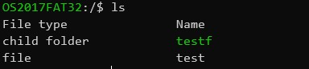
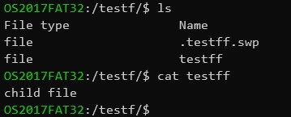

# FAT32 Read

## How to run

1. Generate fat32 img file

    ```bash
    # generate file
    $ mkfs.vfat -n "OS2017FAT32" -F 32 -C fat32d.img 102400
    # mount the img
    $ sudo mount -t vfat -o defaults,users,loop,umask=000,iocharset=utf8 fat32d.img /mnt
    ```

2. Write some file to the file system

    ```bash
    $ cd /mnt
    $ mkdir testf
    # write something
    $ touch "testfile" test
    ```

3. Build project

    ```bash
    $ make
    ```

4. Run

    ```c
    $ ./main
    ```

## Support what

1. ls

2. cd

3. cat

4. tree

5. exit

## Some pic




