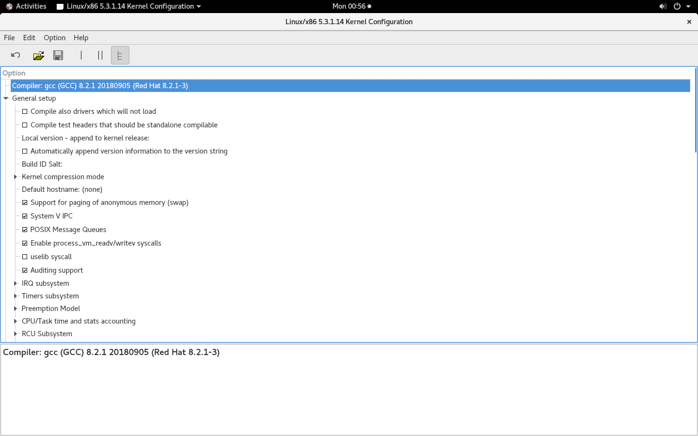
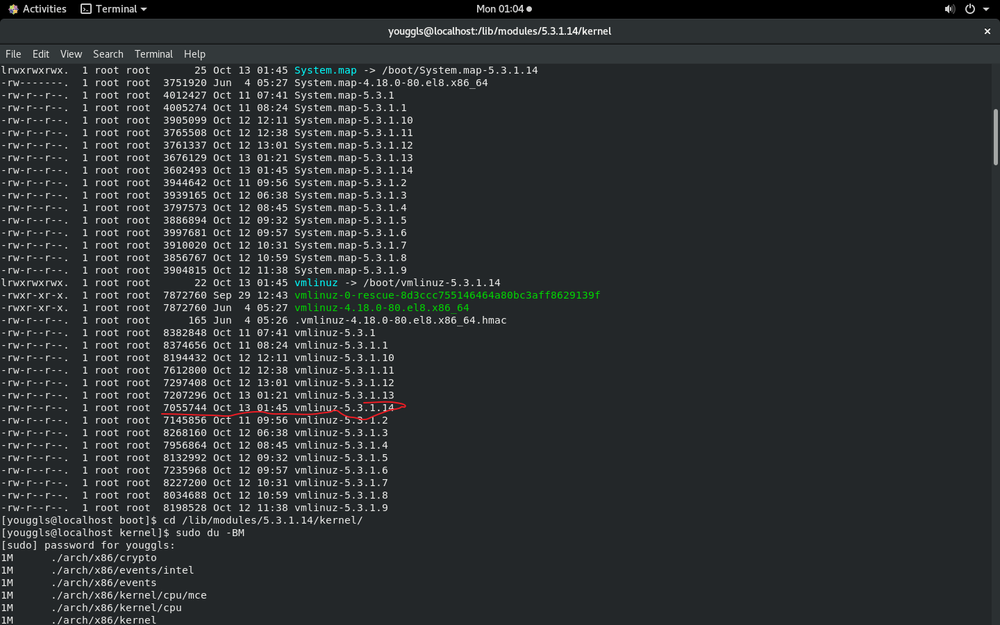
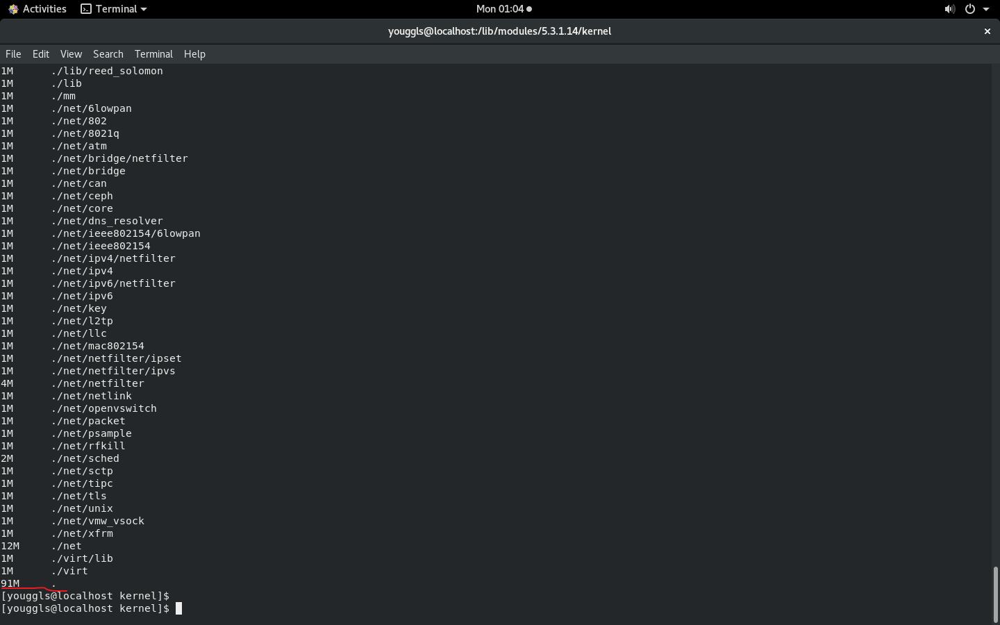

# 操作系统实验报告

## 实验内容

1. 通过多次编译，尝试最小化Linux Kernel

## 实验步骤

1. 进入CentOS虚拟机，进入Linux Kernel源码根目录。

2. 使用`make xconfig`进行Linux Kernel的编译配置。

    

3. 尝试取消勾选不同的选项，以达到最小化安装的目的。

4. 主要取消勾选了以下内容：

    * 声卡驱动相关

    * 无关的显卡驱动

    * NVME设备驱动

    * 多处理器支持

5. 选择完成后，保存config文件，在Terminal中输入`make -j 16`进行编译、安装。

6. 安装成功后，重启，选择新内核，查看是否能够启动

## 实验结果

经过本人十余次编译，最终内核大小如下所示

|内核文件|大小|
|:-------:|:----:|
|/boot/vmlinuz-*|7MB|
|/lib/modules/[kernel version]/kernel|91MB|

## 附：.config配置文件

见邮件附件
