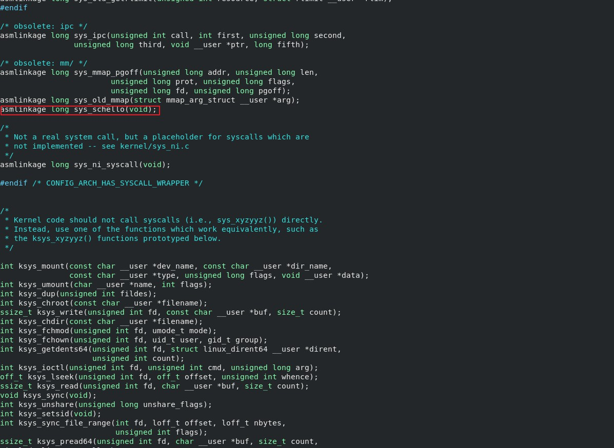
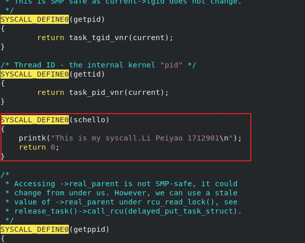
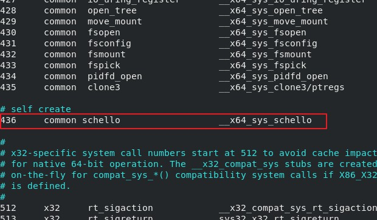
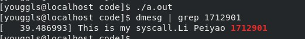
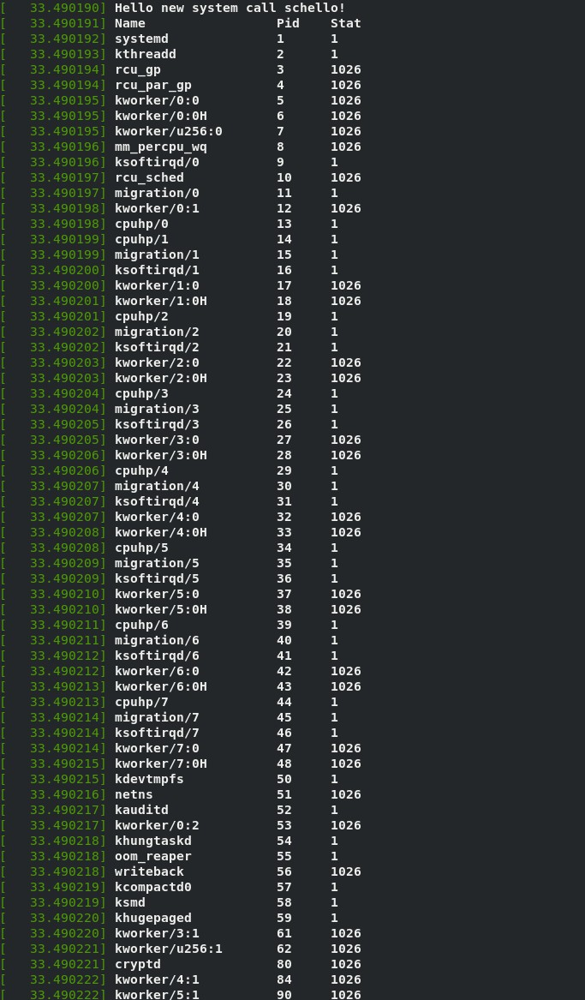

# 操作系统实验报告

## 实验内容

1. 增加一个自定义系统调用

2. 修改这个系统调用，使其能够输出当前所有进程

## 实验过程

1. 修改kernel源码，修改`include/linux/syscall.h`文件

    

2. 修改`kernel/sys.c`文件

    

3. 修改`arch/x86/entry/syscalls/syscall_64.tbl`

    

4. 编译内核，安装

5. 测试系统调用，新建一个`testschell.c`文件，内容如下

    ```c
    #include <unistd.h>
    #include <sys/syscall.h>
    #include <sys/types.h>
    #include <stdio.h>
    #define __NR_schello 436
    int main(int argc, char *argv[])
    {
        syscall(__NR_schello);
        printf("ok! run dmesg | grep hello in terminal!\n");
        return 0;
    }
    ```

6. 编译文件，执行，使用`dmesg`查看输出

    

7. 再次修改`kernel/sys.c`，修改函数定义

    ```c
    SYSCALL_DEFINE0(schello)
    {
        struct task_struct *p;
        printk("Hello new system call schello!\n");
        printk("%-20s %-6s %-6s\n","Name","Pid","Stat");
        for (p = &init_task; (p = next_task(p)) != &init_task;)
        printk("%-20s %-6d %-6ld\n",p->comm,p->pid,p->state);
        return 0;
    }
    ```

8. 同4-6，测试结果

    
