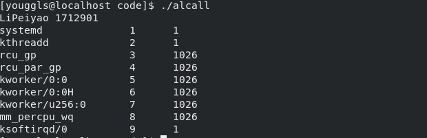
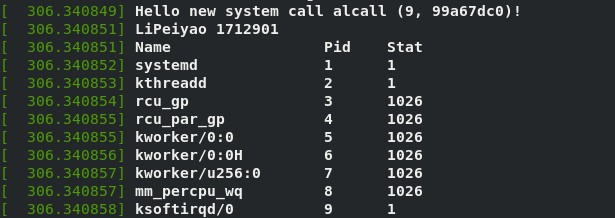

# 操作系统实验报告

## 实验内容

增加一个自定义系统调用，将正在运行进程的结果输出，并将结果写入到用户内存中

## 实验步骤

1. 增加自定义系统调用函数

2. 在`./kernel/sys.c`中实现该函数，如下

    ```c
    SYSCALL_DEFINE2(alcall, int, cmd, char*, buf)
    {
        char temp[256];
        char buf1[40960];
        int i = 0;
        struct task_struct *p;
        printk("Hello new system call alcall (%d, %x)!\n", cmd, buf);
        sprintf(buf1, "Hello new system call alcall (%d, %x)!\n", cmd, buf);
        printk("LiPeiyao 1712901\n");
        sprintf(buf1, "LiPeiyao 1712901\n");
        printk("%-20s %-6s %-6s\n", "Name", "Pid", "Stat");
        for (p = &init_task; (p = next_task(p)) != &init_task;) {
            printk("%-20s %-6d %-6ld\n", p->comm, p->pid, p->state);
            snprintf(temp, sizeof(temp), "%-20s %-6d %-6ld\n", p->comm, p->pid, p->state);
            strcat(buf1, temp);
            i++;
            if (i >= cmd) break;
        }
        printk("Ready to copy to user");
        copy_to_user(buf, buf1, strlen(buf1));
        return 0;
    }
    ```

3. 编译内核，安装

4. 编写用户测试程序，编译运行

    ```c
    #include <unistd.h>
    #include <sys/syscall.h>
    #include <sys/types.h>
    #include <stdio.h>

    int main(int argc, char* argv[])
    {
        int cmd;
        char buf[1000];
        cmd = 9;
        syscall(437, cmd, buf);
        printf("%s", buf);
        return 0;
    }
    ```

## 实验结果

用户程序输出结果


内核输出结果
