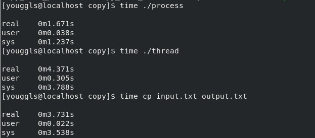
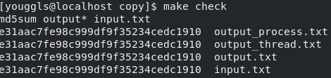

# 操作系统实验报告

## 实验内容

1. 利用C语言相关库，用简单的进程实现一个文件拷贝的程序

2. 利用C语言相关库，用线程实现一个文件拷贝的程序

3. 使用Linux cp命令拷贝文件

4. 使用md5sum校验拷贝结果

5. 比较拷贝效率

## 实验步骤

1. 使用C语言的FILE指针对文件进行读入写入操作，为了实现快速拷贝文件，为buffer分配了102400的空间。

    ```c
    #include <stdlib.h>
    #include <string.h>
    #include <stdio.h>

    char buffer[102400];

    void process_copy_file()
    {
        FILE* input;
        FILE* output;
        input = fopen("./input.txt", "r+");
        output = fopen("./output_process.txt", "w+");
        int len = 0;
        while (len = fread(buffer, 1, sizeof(buffer), input))
        {
            fwrite(buffer, 1, len, output);
        }
        fclose(output);
        fclose(input);
    }

    int main (int argc, char* argv[])
    {
        process_copy_file();
        return 0;
    }
    ```

2. 线程版实现基本与进程版一致，知识将拷贝函数交给线程实现，同时在主函数等待该线程结束再退出

    ```c
    #include <pthread>
    #include <stdlib.h>
    #include <string.h>
    #include <stdio.h>

    void* thread_copy_file(void* arg)
    {
        char* buffer[1024];
        FILE* input;
        FILE* output;
        input = fopen("./input.txt", "r+");
        output = fopen("./output_thread.txt", "w+");
        int len = 0;
        while (len = fread(buffer, 1, sizeof(buffer), input))
        {
            fwrite(buffer, 1, len, output);
        }
        fclose(output);
        fclose(input);
        pthread_exit(0);
    }

    int main (int argc, char* argv[])
    {
        pthread_t thread;
        pthread_create(&thread, NULL, thread_copy_file, NULL);
        pthread_join(thread, NULL);
        return 0;
    }
    ```

## 实验结果

1. 利用dd命令，生成随机的大文本文件`dd if=/dev/urandom of=input.txt bs=1M count=1000`

2. 使用time命令执行并观察所用时间

    

3. 使用md5sum校验文件

    

## 实验分析总结

可以看到，进程版实现的C语言效率较高，主要有两点原因：

1. 没有线程的额外开销

2. buffer较大，保证一次读入较多的内容
