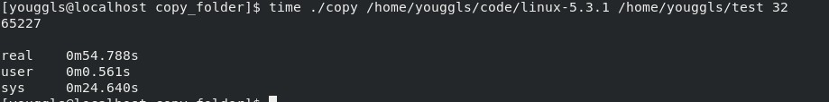

# 操作系统实验报告

## 实验内容

用C语言多线程实现文件拷贝

## 实验分析

1. 实现文件拷贝，首先要对源文件夹进行遍历，抵达文件树的叶节点

2. 缓存每个叶节点文件路径，对每个节点开启线程，进行拷贝

## 实验步骤

1. 利用C语言实现遍历文件夹的功能

    ```c
    int walk_path(char* base_path, char* file_path, char* target_folder_path,
                  char** all_file_buffer, size_t* count)
    {
        DIR* dir;
        char current_path[200];
        if (strcmp(file_path, "") == 0) sprintf(current_path, "%s", base_path);
        else sprintf(current_path, "%s/%s", base_path, file_path);
        struct dirent* ptr;
        if ((dir = opendir(current_path)) == NULL) return _CANNOT_OPEN_FILE;
        while ((ptr=readdir(dir)) != NULL) {
            if (strcmp(ptr->d_name, ".") == 0 || strcmp(ptr->d_name, "..") == 0)
                continue;
            else if (ptr->d_type == 8) {
                sprintf(all_file_buffer[*count], "%s/%s", file_path, ptr->d_name);
                (*count)++;
            } else if (ptr->d_type == 4) {
                char temp[200];
                char* temp_target = strdup(target_folder_path);
                sprintf(all_file_buffer[*count], "%s/%s", file_path, ptr->d_name);
                sprintf(temp, "%s%s/", temp_target, all_file_buffer[*count]);
                mkdir(temp, 0777);
                char* child_folder_path = strdup(all_file_buffer[*count]);
                int ans = walk_path(base_path, child_folder_path, target_folder_path,all_file_buffer, count);
                if (ans == _CANNOT_OPEN_FILE) return ans;
            }
        }
        return _OPEN_SUCCESS;
    }
    ```

2. 利用多线程进行文件拷贝

    ```c
    void* copy_file(void* arg) {
        struct thread_arg* arguement = (struct thread_arg*)arg;
        sem_wait(arguement->semaphore);
        while(current_thread_num <= 0);
            current_thread_num--;
        char buffer[BUFFER_SIZE];
        char file_path[300];
        char output_file_path[300];
        sprintf(file_path, "%s%s", arguement->base_path, arguement->all_file_path[arguement->index]);
        sprintf(output_file_path, "%s%s", arguement->target_base_path, arguement->all_file_path[arguement->index]);
        sem_post(arguement->semaphore);
        FILE* input = fopen(file_path, "r+");
        if (input == NULL) {
            printf("%d\n", current_thread_num);
            printf("input file: %s cannot open\n", file_path);
            printf("open fail errno = %d reason = %s \n", errno, strerror(errno));
            return NULL;
        }
        FILE* output = fopen(output_file_path, "w+");
        printf("%s\n", output_file_path);
        output = fopen(output_file_path, "w+");
        printf("open fail errno = %d reason = %s \n", errno, strerror(errno));
        }
        int len = 0;
        while (len = fread(buffer, 1, sizeof(buffer), input)) {
            fwrite(buffer, 1, len, output);
        }
        fclose(output);
        fclose(input);
        sem_post(arguement->current_thread_num);
        pthread_exit(NULL);
    }
    ```

## 实验结果

拷贝linux kernel源码，结果如下：


