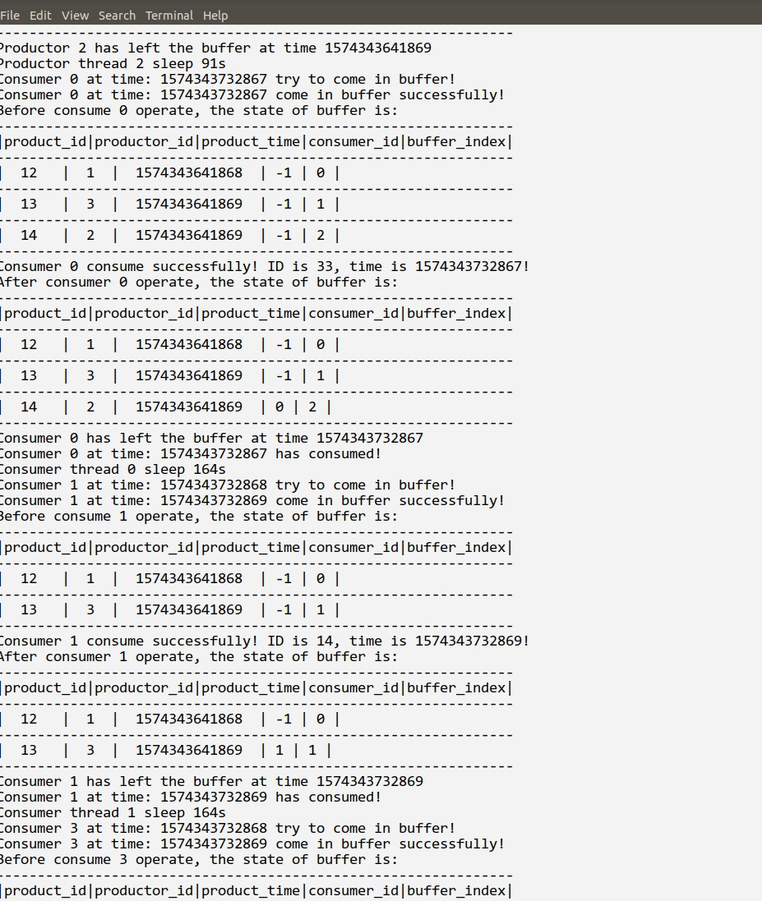

# 操作系统实验报告

## 实验内容

使用C语言和信号量解决生产者消费者问题

## 实验分析

1. 为了实现描述产品，需要构造一个产品结构体，包含产品号、生产者号、生产时间、缓冲区内编号

2. 为了实现缓冲区，需要构造一个缓冲区结构体，包含缓冲区内存空间、信号量

3. 所需的信号量应该有三个：缓冲区满、缓冲区空、缓冲区忙

## 实验步骤

1. 用C语言描述商品结构体

    ```c
    typedef struct product_struct
    {
        int product_id;
        int buffer_id;
        productor productor_id;
        consumer consumer_id;
        time_t product_time;
    } product;
    ```

2. 用C语言描述缓冲区结构体

    ```c
    typedef struct product_list_struct
    {
        size_t buffer_size;
        size_t last_product;
        product *buffer;
        sem_t full;
        sem_t empty;
        sem_t mutex;
    } product_buffer;
    ```

3. 实现购买商品、消费商品的函数，注意输入输出的同时，对信号量进行操作

    ```c
    void begin_product(productor *p, product_buffer *buffer)
    {
        printf("Productor %d at time: %ld ready to product!\n", *p, get_current_time());
        printf("Productor %d at time: %ld try to come in buffer!\n", *p, get_current_time());
        sem_wait(&(buffer->empty));
        sem_wait(&(buffer->mutex));
        printf("Productor %d at time: %ld come in buffer successfully!\n", *p, get_current_time());
        printf("Before Product %d operate, the state of buffer is: \n", *p);
        print_buffer(buffer);
        size_t index = buffer->last_product;
        buffer->buffer[index].productor_id = *p;
        buffer->buffer[index].product_time = get_current_time();
        buffer->buffer[index].product_id = global_product_id;
        global_product_id++;
        buffer->buffer[index].buffer_id = index;
        buffer->buffer[index].consumer_id = NOT_SET;
        buffer->last_product += 1;
        printf("Productor %d product successfully! ID is %d, time is %ld!\n", *p, global_product_id - 1, get_current_time());
        printf("After Product %d operate, the state of buffer is: \n", *p);
        print_buffer(buffer);
        sem_post(&(buffer->mutex));
        sem_post(&(buffer->full));
        printf("Productor %d has left the buffer at time %ld\n", *p, get_current_time());
    }
    ```

    ```c
    void consume_product(consumer *c, product_buffer *buffer)
    {
        printf("Consumer %d at time: %ld try to come in buffer!\n", *c, get_current_time());
        sem_wait(&(buffer->full));
        sem_wait(&(buffer->mutex));
        printf("Consumer %d at time: %ld come in buffer successfully!\n", *c, get_current_time());
        printf("Before consume %d operate, the state of buffer is: \n", *c);
        print_buffer(buffer);
        size_t index = buffer->last_product;
        buffer->buffer[index - 1].consumer_id = *c;
        printf("Consumer %d consume successfully! ID is %d, time is %ld!\n", *c, buffer->buffer[index].product_id, get_current_time());
        printf("After consumer %d operate, the state of buffer is: \n", *c);
        print_buffer(buffer);
        buffer->last_product -= 1;
        sem_post(&(buffer->mutex));
        sem_post(&(buffer->empty));
        printf("Consumer %d has left the buffer at time %ld\n", *c, get_current_time());
        printf("Consumer %d at time: %ld has consumed!\n", *c, get_current_time());
    }
    ```

## 实验结果



## 附录：其他函数

1. 初始化函数

    ```c
    product_buffer *init_buffer(size_t size)
    {
        product_buffer *rev = (product_buffer *)malloc(sizeof(product_buffer));
        rev->buffer = (product *)malloc(sizeof(product) * size);
        rev->buffer_size = size;
        rev->last_product = 0;
        sem_init(&(rev->full), 0, 0);
        sem_init(&(rev->empty), 0, size);
        sem_init(&(rev->mutex), 0, 1);
        return rev;
    }

    product *init_product()
    {
        product *rev = (product *)malloc(sizeof(product));
        rev->consumer_id = NOT_SET;
        rev->product_id = NOT_SET;
        rev->productor_id = NOT_SET;
        rev->buffer_id = NOT_SET;
        return rev;
    }
    ```

2. 输出函数

    ```c
    void print_buffer(product_buffer *buffer)
    {
        if (buffer->last_product == 0) {
            printf("Buffer is empty\n");
            return;
        }
        printf("---------------------------------------------------------------\n");
        printf("|product_id|productor_id|product_time|consumer_id|buffer_index|\n");
        printf("---------------------------------------------------------------\n");
        for (size_t i = 0; i < buffer->last_product; ++i)
        {
            printf("|  %d   |  %d  |  %ld  | %d | %d |\n", buffer->buffer[i].product_id,
            buffer->buffer[i].productor_id,
            buffer->buffer[i].product_time,
            buffer->buffer[i].consumer_id,
            buffer->buffer[i].buffer_id);
            printf("---------------------------------------------------------------\n");
        }
    }
    ```
