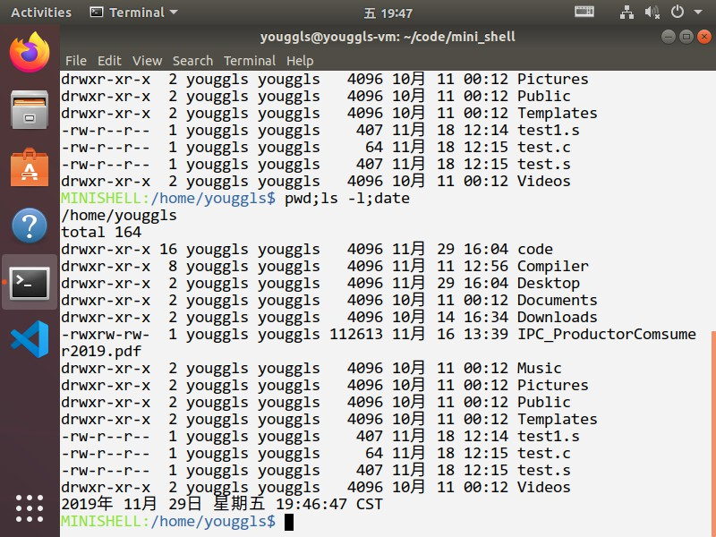
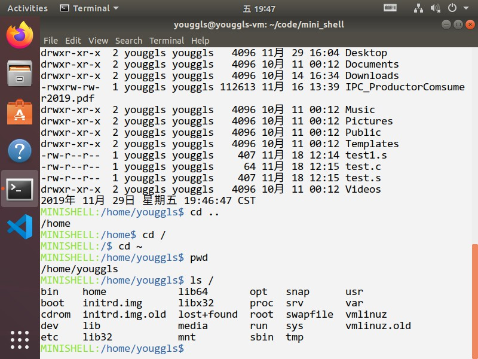

# 操作系统实验报告

## 实验内容

实现一个mini shell

## 实验分析

1. 为了实现shell的路径功能，需要保存一个全局变量表示路径

2. 为了从输入读取命令并执行，对每个命令需要fork一个子进程

## 实验步骤

1. 从输入读取命令并解析

    ```c
    while (getline(&command_str, &max_len, stdin)) {
        command_str[strlen(command_str) - 1] = '\0';
        if (strcmp(command_str, "exit") == 0) {
            break;
        }

        command* temp = deliver_input(strdup(command_str));
        while (temp) {
            if (temp->word_num != 0) {
                int rev = run_command(temp);
            }
            temp = temp->nxt_command;
        }
        printInfo();
        delete_commands(temp);
    }
    ```

    ```c
    command* deliver_input(char* input) {
        int input_len = strlen(input);
        int left = 0, right = 0;
        int command_num = 0, command_args = 0;
        command* commands = init_command();
        command* head = commands;
        while (left <= right && right < input_len) {
            if (input[right] == ' ' || input[right] == '\t') {
                if (left < right) {
                    strncpy(commands->command_words[command_args++], input + left,  right - left);
                    right++;
                    left = right;
                } else {
                    left++;
                    right++;
                    continue;
                }
            } else if (input[right] == ';') {
                if (left < right) {
                    strncpy(commands->command_words[command_args++], input + left, right - left);
                }
                right++;
                left = right;
                commands->word_num = command_args;
                if (right < input_len) {
                    command* temp = init_command();
                    commands->nxt_command = temp;
                    commands = temp;
                    command_args = 0;
                }
            } else if (right == input_len - 1) {
                if (left <= right) {
                    strncpy(commands->command_words[command_args++], input + left,  right - left + 1);
                    commands->nxt_command = NULL;
                    commands->word_num = command_args;
                    break;
                }
            } else {
                right++;
            }
        }
        replace_current_dir(head);
        return head;
    }
    ```

2. 实现cd命令

    ```c
    int cd_command(command* command) {
        int word_num = command->word_num;
        if (word_num != 2) {
            printf("\033[31mPlease input a dir path!\n\033[0m");
            return ERROR;
        } else {
            if (command->command_words[1][0] == '~') {
                if (strlen(command->command_words[1]) == 1) strcpy(current_dir, user_dir);
                else {
                    char target_path[100];
                    sprintf(target_path, "%s/%s", user_dir, command->command_words[1] + 2);
                    if (opendir(target_path) == NULL) {
                        printf("\033[31mInvalid path, please check your permission or  judge is the folder exist.\n\033[0m");
                        return ERROR;
                    } else {
                        strcpy(current_dir, target_path);
                    }
                }
            } else if (strcmp(command->command_words[1], "..") == 0) {
                char* parent_dir = dirname(current_dir);
                printf("%s\n", parent_dir);
                strcpy(current_dir, parent_dir);
            } else if (command->command_words[1][0] == '/') {
                if (opendir(command->command_words[1]) == NULL) {
                    printf("\033[31mInvalid path, please check your permission or judge is the folder exist.\n\033[0m");
                    return ERROR;
                } else {
                    strcpy(current_dir, command->command_words[1]);
                }
            } else {
                char target_path[100];
                if (strcmp(current_dir, "/") == 0) {
                    sprintf(target_path, "/%s", command->command_words[1]);
                } else sprintf(target_path, "%s/%s", current_dir,       command->command_words[1]);
                if (opendir(target_path) == NULL) {
                    printf("\033[31mInvalid path, please check your permission or judge is the folder exist.\n\033[0m");
                    return ERROR;
                } else {
                    strcpy(current_dir, target_path);
                }
            }
        }
        return SUCCESS;
    }
    ```

3. 执行其他命令

    ```c
    int run_command(command* command) {
        int word_num = command->word_num;
        if (strcmp(command->command_words[0], "cd") == 0) {
            return cd_command(command);
        } else if (strcmp(command->command_words[0], "pwd") == 0){
            return pwd_command();
        } else if (strcmp(command->command_words[0], "ls") == 0) {
            pid_t pid = fork(), wpid;
            int status;
            if (pid == 0) {
                if (word_num == 1) {
                    char* args[] = {"ls", current_dir, 0};
                    int rev = execvp("ls", args);
                    if (rev < 0) {
                        printf("\033[31m%s\n\033[0m", strerror(errno));
                    }
                } else if (word_num == 2 && (strcmp(command->command_words[1], "-al") == 0) ||
                                        (strcmp(command->command_words[1], "-l") == 0) ||
                                        (strcmp(command->command_words[1], "-a") == 0)) {
                    char* args[4] = {"ls", command->command_words[1], current_dir, NULL};
                    int rev = execvp("ls", args);
                    if (rev < 0) {
                        printf("\033[31m%s\n\033[0m", strerror(errno));
                    }
                } else {
                    char* args[word_num + 1];
                    for (int i = 0; i < word_num; i++) {
                        args[i] = command->command_words[i];
                    }
                    args[word_num] = NULL;
                    int rev = execvp("ls", args);
                    if (rev < 0) {
                        printf("\033[31m%s\n\033[0m", strerror(errno));
                    }
                }
                exit(0);
            } else if (pid > 0) {
                do {
                    wpid = waitpid(pid, &status, WUNTRACED);
                } while (!WIFEXITED(status) && !WIFSIGNALED(status));
            }
        } else {
            pid_t pid, wpid;
            int status;
            pid = fork();
            if (pid == 0) {
                char* args[word_num];
                for (int i = 0; i < word_num; i++) {
                    args[i] = command->command_words[i];
                }
                args[word_num] = NULL;
                int rev = execvp(args[0], args);
                if (rev < 0) {
                    printf("\033[31m%s\n\033[0m", strerror(errno));
                }
                exit(0);
            } else if (pid > 0) {
                do {
                    wpid = waitpid(pid, &status, WUNTRACED);
                } while (!WIFEXITED(status) && !WIFSIGNALED(status));
            }
        }
        return SUCCESS;
    }
    ```

## 实验结果





## 附录

commnd结构体代码：

```c
typedef struct command_str {
    int word_num;
    char** command_words;
    struct command_str* nxt_command;
} command;

command* init_command() {
    command* temp = (command*)malloc(sizeof(command));
    temp->nxt_command = NULL;
    temp->command_words = (char**)malloc(sizeof(char*) * 256);
    for (int i = 0; i < 256; i++) {
        temp->command_words[i] = (char*)malloc(sizeof(char) * 100);
    }
    temp->word_num = 0;
}

void delete_commands(command* c) {
    if (c == NULL) return;
    if (c->nxt_command) {
        delete_commands(c->nxt_command);
    } else {
        for (int i = 0; i < 256; i++) {
            free(c->command_words[i]);
        }
        free(c->command_words);
    }
}
```
