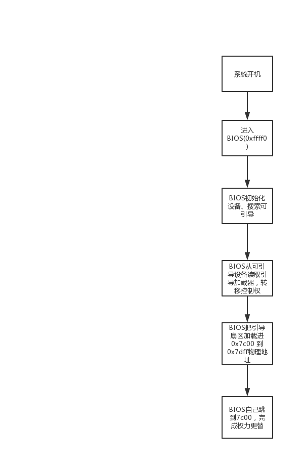
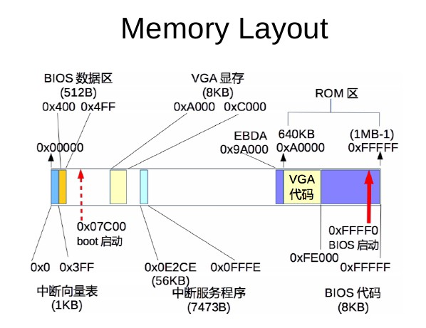

# 操作系统实验报告

## 实验内容

完成PC的引导过程

## 实验分析

1. 首先，系统开机
2. 系统进入`0xffff0`地址，开始执行 BIOS（Basic Input and output System）
3. BIOS进行一系列的设备初始化工作
4. BIOS把引导设备（如硬盘、USB）的第一块扇区 读入内存(`0x7c00 ~ 0x7dff`)

    

5. 实模式下，内存布局如图所示，在开机引导过程中，只需要向VGA显存区(`0xA000~0xC000`)写入数据即可显示在屏幕上。

    

## 实验过程

1. 安装依赖：由于操作系统位64位，而目标引导程序要工作在32位下，我们需要交叉编译。使用`sudo apt install gcc-multilib`安装32位库。

2. 完成boot.S文件的编写

    ```x86asm
    .globl start
    start:
        .code16
        cli
        cld

        xorw    %ax, %ax
        movw    %ax, %ds
        movw    %ax, %es
        movw    %ax, %ss

        movw    $0xb800, %ax
        movw    %ax, %es
        movw    $msgl, %si
        movw    $0xb88, %di
        movw    $0x14, %cx
        rep     movsb

    spin:
        jmp spin

    msgl:
        .byte 'l',0xc,'l',0x9,'l',0xc,'l',0x9,'l',0xc,'l',0x9,'l',0xc
        .byte 'o',0x9,'.',0xc,'.',0x9

        .org 510
        .word   0xAA55
    ```

3. 执行`make run`，观察bochs虚拟机的输出

## 实验结果

